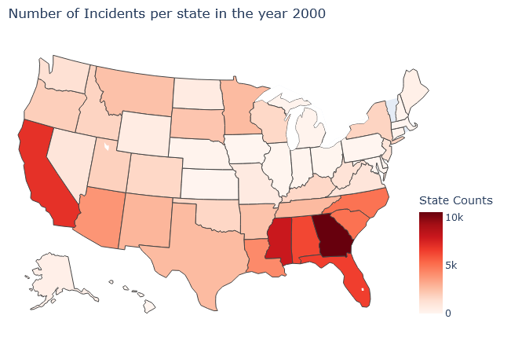
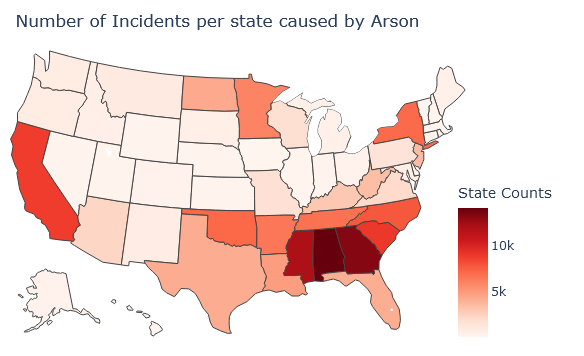

# CDC 2023
Natural Science: Wildfires in the US (2000 - 2010)

# Team Members:
Shivani Kale
David Kim
Andy Chan
Haosheng Shi

# Problem Statement

__We want to provide a visible index with which different states across the __  __country__  __ can use to better channel their efforts in preventing and addressing wildfires__

# Agenda
Data Cleaning & Wrangling
Feature Engineering
Data Analysis (Descriptive)
Data Analysis (Diagnostic)
Impact Analysis
Future of this project
Conclusion

# Data Cleaning & Wrangling

Selected features for descriptive and diagnostic analysis

Dropped a feature with 100% Null values

Generated additional features from subsets for enhanced descriptive analysis

# Feature Engineering

Created DISCOVERY\_MONTH feature based on DISCOVERY\_DOY

Created Time Difference feature to calculate the time required for containing the fire\.

# Checking Correlation between Features

Performed Label Encoding for categorical fields\.

The Heatmap does not show high correlation between data fields\.

# Charts from Descriptive Analysis

# Geographical Visualization of Descriptive Analysis

# Geographical Visualization of Diagnostic Analysis

# Impact Analysis

Descriptive and diagnostic analysis from previous wildfire episodes can serve as basis for identifying frequent patterns and generate substantiated measures for future incidents

Resource management may refine containment measures by looking at descriptive features such as number of acres harmed and time required to contain the fire

States may adjust where to focus their attention by looking at diagnostic features in causes and geographical analysis in which parts of the country were most affected by particular causes

# Future of this Project

The data can be linked with financial data to understand financial implications and requirements\.

Resources data can be added to understand the resources required to address this issue and the amount of resources required\.

We can extend the project to analyze more dataset based on the most probable cause of the fire incident\.

# Conclusion

__Almost all states have experienced wildfires in some form\, which left “unforgettable” damage to our country as a whole\. __

__By visibly framing numerous causes and __  __consequence__  __ of wildfires through descriptive and diagnostic analysis\, we hope to__  __ improve concentrating __  __efforts in preventing and handling wildfires__

# Thank you!

We welcome Q&As and feedbacks.

